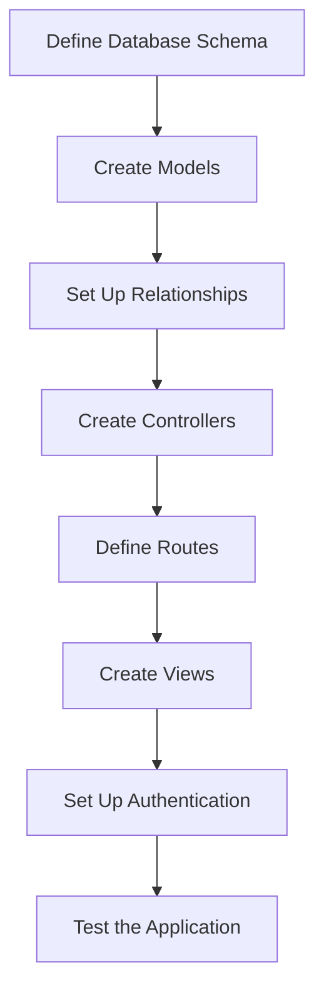

# Product Catalog Webapp Plan

## Objective
Build a sample webapp with a product catalog that includes categories and products.

## Detailed Plan

### 1. Define the Database Schema
- Create migrations for categories and products.

### 2. Create Models
- Define the Category and Product models.

### 3. Set Up Relationships
- Define the relationships between categories and products.

### 4. Create Controllers
- Create controllers for handling category and product operations.

### 5. Define Routes
- Set up routes for category and product operations.

### 6. Create Views
- Create views for displaying categories and products.

### 7. Set Up Authentication
- Ensure user authentication is in place.

### 8. Test the Application
- Write tests to ensure the application works as expected.

## Mermaid Diagram

## Plan Summary

1. **Define the Database Schema**:
   - Create migrations for categories and products.

2. **Create Models**:
   - Define the Category and Product models.

3. **Set Up Relationships**:
   - Define the relationships between categories and products.

4. **Create Controllers**:
   - Create controllers for handling category and product operations.

5. **Define Routes**:
   - Set up routes for category and product operations.

6. **Create Views**:
   - Create views for displaying categories and products.

7. **Set Up Authentication**:
   - Ensure user authentication is in place.

8. **Test the Application**:
   - Write tests to ensure the application works as expected.
